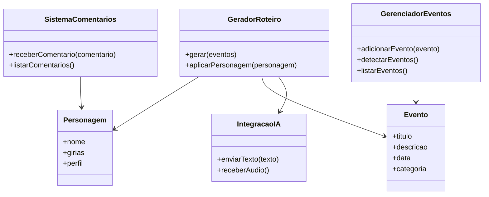

# 🎙️ BUBUIA NEWS - Podcast Automatizado

_"Notícia quente direto do igarapé."_

## 📻 Sobre o Podcast

**BubuiA News** é um podcast diário automatizado que traz as principais notícias do Amazonas, Manaus e do Brasil com o tempero único da nossa região. Apresentado pelos carismáticos Tainá Oliveira e Iray Santos, duas personalidades criadas por IA que capturam a essência, as gírias e o jeito amazonense de ser.

### 🎯 Conceito

- **Foco regional:** Notícias do Amazonas e Manaus em primeiro lugar
- **Personalidades autênticas:** Apresentadores com gírias e sotaque local
- **Automatização inteligente:** IA detecta eventos, gera roteiros e produz áudios
- **Interação real:** Sistema para receber comentários dos ouvintes

### 🗣️ Apresentadores

**👩‍🎤 Tainá Oliveira**

- Personalidade animada e extrovertida
- Torcedora do Garantido
- Gírias: "oxe", "meu pai eterno", "cabra danada"

**👨‍🎤 Iray Santos**

- Mais reflexivo e ponderado
- Torcedor do Caprichoso
- Gírias: "vichi", "caboco", "é bem assim mesmo"

---

## 🚀 Funcionalidades

### ✅ Já Implementado

- **Detecção automática de eventos** em notícias
- **Geração de roteiros dinâmicos** com 30+ placeholders
- **Sistema de comentários** de ouvintes
- **Integração com TTS** (ElevenLabs/Azure)
- **Gestão inteligente de eventos** (manual e automático)

### 🔄 Em Desenvolvimento

- Integração com APIs de notícias
- Geração automática de áudios
- Sistema de publicação RSS
- Dashboard de monitoramento

---

## 🛠️ Como Usar

### Instalação

```bash
cd "c:\Meu Drive\podcast-ia"
npm install
```

### Gerar Roteiro

```bash
npm run gerar-roteiro
```

### Adicionar Evento

```bash
npm run adicionar-evento "Festival de Verão" "Grande festa na Ponta Negra" "2025-07-15" "entretenimento"
```

### Configurar APIs

1. Edite `config/ia-config.json`
2. Adicione suas chaves de API
3. Execute `npm run processar-completo`

---

## 📁 Estrutura do Projeto

```
/podcast-ia
├── core/
│   ├── gerarRoteiro.js
│   ├── integracaoIA.js
│   ├── dialogosEspontaneos.js
│   ├── sistemaRevisao.js
│   ├── classificadorContextual.js
│   ├── comentariosContextuais.js
│   ├── gerenciadorEventos.js
│   ├── mixadorAutomatico.js
│   ├── geradorFalasIA.js
│   └── integradorElevenLabs.js
├── data/
│   ├── personagens.json
│   ├── eventos.json
│   └── girias.json
├── config/
│   ├── ia-config.json
│   ├── tts-emocional.json
│   └── revisao-config.json
├── scripts/
│   ├── processarCorrecoes.js
│   ├── verificarImportacoes.js
│   └── ... outros scripts
├── templates/
├── episodios/
├── audios/
├── temp_audio/
├── revisao/
├── docs/
└── logs/
```

---

## 🎵 Exemplo de Roteiro

```markdown
# 🎙️ BUBUIA NEWS - ROTEIRO DIÁRIO

"Notícia quente direto do igarapé."

## 🎵 ABERTURA

Tainá: "Fala maninho, tá começando mais um BubuiA News! Oxe, meu povo!"
Iray: "E aí, pessoal! Vichi, tô aqui também no BubuiA News! Notícia quente direto do igarapé pra vocês!"

## 📰 NOTÍCIAS

[Conteúdo dinâmico baseado em eventos detectados]

## 🎵 ENCERRAMENTO

Ambos: "E lembrem: aqui é BubuiA News, notícia quente direto do igarapé!"
```

---

## 🗂️ Diagrama de Classes (Mermaid)



---

## 📞 Contribuição

Este é um projeto open-source! Contribuições são bem-vindas:

1. Fork o projeto
2. Crie uma branch para sua feature
3. Commit suas mudanças
4. Push para a branch
5. Abra um Pull Request

---

## 📄 Licença

MIT License - Veja o arquivo LICENSE para detalhes.

---

_Desenvolvido com ❤️ para levar as notícias do Amazonas para o mundo todo!_
