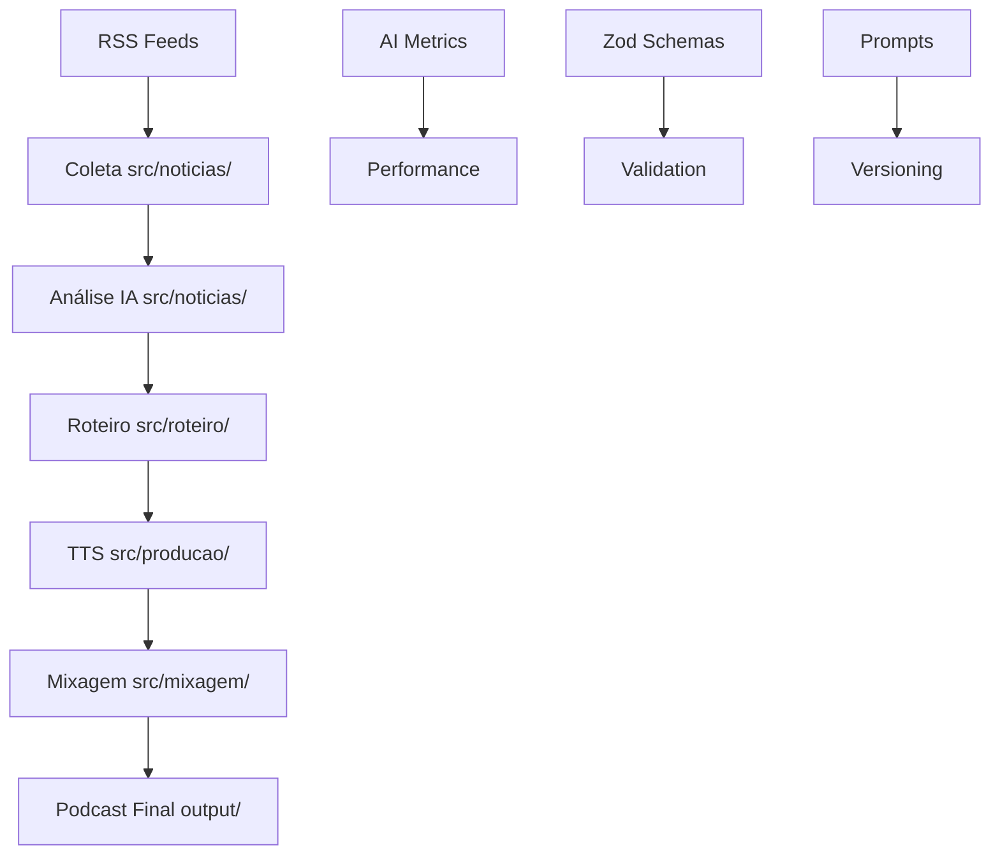

# 🤖 AI Context - Bubuia News | Guia Completo para IA

## 🎯 TL;DR para IA

- **Projeto**: Pipeline automatizado de podcast de notícias locais do Amazonas
- **Tech Stack**: TypeScript + Zod + OpenAI/Gemini + ElevenLabs + FFmpeg
- **Arquitetura**: Trio de Ouro (Schemas + Prompts + AI Tags)
- **Fluxo Principal**: Coleta → Análise → Roteiro → Áudio → Mixagem
- **Status**: Produção ativa | AI-first | Type-safe

---

## 📋 ÍNDICE RÁPIDO

1. [Arquitetura do Sistema](#-arquitetura-do-sistema)
2. [Trio de Ouro](#-trio-de-ouro-fundação-ai-friendly)
3. [Padrões Obrigatórios](#-padrões-obrigatórios)
4. [Pipeline Completo](#-pipeline-completo)
5. [Estrutura de Arquivos](#-estrutura-de-arquivos)
6. [APIs e Integrações](#-apis-e-integrações)
7. [Como Contribuir](#-como-contribuir-como-ia)
8. [Templates e Exemplos](#-templates-e-exemplos)
9. [Troubleshooting](#-troubleshooting)

---

## 🏗️ ARQUITETURA DO SISTEMA

### **Visão Geral**



### **Fluxo Detalhado**

1. **Coleta** (`src/noticias/buscarNoticias.ts`): RSS feeds → Notícias brutas
2. **Análise** (`src/noticias/analisarNoticias.ts`): IA classifica + contextualiza
3. **Roteiro** (`src/roteiro/gerarRoteiro.ts`): IA gera script conversacional
4. **Produção** (`src/producao/gerarAudio.ts`): TTS multivozes
5. **Mixagem** (`src/mixagem/montarEpisodio.ts`): Podcast final com trilhas

---

## 🎯 TRIO DE OURO (Fundação AI-Friendly)

### **1. Schemas Zod (Type Safety)**

```typescript
// SEMPRE use schemas para validação
import { validateWithSchema } from '../utils/validation.js';
import { NoticiaCruaSchema } from '../schemas/core.schemas.js';

const noticias = validateWithSchema(
  rawData,
  NoticiaCruaSchema,
  'buscarNoticias.input'
);
```

### **2. Prompts Estruturados (Versionados)**

```typescript
// SEMPRE use templates para prompts
import {
  createPromptTemplate,
  renderTemplate,
} from '../ai/prompts/prompt-template.js';

const template = createPromptTemplate(
  'classify-news-v2',
  'Classificação de Notícias',
  'Analise esta notícia: {{content}}...',
  ['content', 'context']
);
```

### **3. AI Tags (Documentação Rica)**

```typescript
/**
 * @ai-purpose Função que coleta notícias de feeds RSS específicos do Amazonas
 * @ai-input-format Array de URLs de RSS feeds regionais
 * @ai-output-format Array de objetos NoticiaCrua validados com Zod
 * @ai-dependencies axios, xml2js, schemas Zod
 * @ai-error-handling Try/catch com logs estruturados e retry automático
 * @ai-performance ~30s para 10 feeds, cache de 1h para evitar spam
 * @ai-validation Usa NoticiaCruaSchema para garantir dados consistentes
 * @ai-monitoring Logs de success/failure, métricas de performance
 */
export async function exemploFuncao() {
  // Implementação...
}
```

---

## ⚡ PADRÕES OBRIGATÓRIOS

### **1. Tipagem TypeScript Rigorosa**

```typescript
// ✅ BOM - Types explícitos
interface ProcessResult {
  success: boolean;
  data?: ProcessedData;
  error?: string;
}

// ❌ EVITAR - any ou tipos implícitos
function process(data: any): any {}
```

### **2. Validação com Zod**

```typescript
// ✅ SEMPRE validar entrada e saída
export async function analisarNoticias(inputFile: string) {
  const noticias = await loadJsonFile(inputFile);
  const validatedInput = validateWithSchema(
    noticias,
    z.array(NoticiaCruaSchema),
    'analisarNoticias.input'
  );

  const pauta = await generatePauta(validatedInput);
  return validateWithSchema(pauta, PautaDoDiaSchema, 'analisarNoticias.output');
}
```

### **3. Logs Estruturados**

```typescript
// ✅ Use o logger estruturado
import { logInfo, logError, logWarning } from '../utils/logger.js';

logInfo('Iniciando análise', {
  totalNoticias: noticias.length,
  fonte: 'RSS_FEEDS',
});

try {
  // operação
  logInfo('Análise concluída', { sucessoRate: 0.95 });
} catch (error) {
  logError('Falha na análise', error, { contexto: 'analisarNoticias' });
}
```

### **4. Error Handling Robusto**

```typescript
// ✅ Padrão de error handling
try {
  const result = await operacaoComIA();
  return result;
} catch (error) {
  if (error instanceof ValidationError) {
    logError('Dados inválidos', error, { input: sanitizedInput });
    throw new Error(`Validação falhou: ${error.message}`);
  }

  if (error instanceof APIError) {
    logError('API falhou', error, { retries: attempt });
    // Implementar retry se apropriado
  }

  logError('Erro inesperado', error);
  throw error;
}
```

### **5. Configuração Centralizada**

```typescript
// ✅ Use src/config.ts
import { config } from '../config.js';

const apiKey = config.apis.openai.key;
const model = config.apis.openai.model;
```

---

## 🔄 PIPELINE COMPLETO

### **Comando de Execução**

```bash
npm run pipeline  # Executa fluxo completo
npm run buscar    # Apenas coleta
npm run analisar  # Apenas análise
npm run roteirizar # Apenas roteiro
npm run audios    # Apenas TTS
npm run montar    # Apenas mixagem
```

### **Pipeline Interno**

```typescript
// Fluxo típico de dados
NoticiaCrua[]
  → (analisarNoticias) →
PautaDoDia
  → (gerarRoteiro) →
RoteiroPodcast
  → (gerarAudios) →
AudioGerado[]
  → (montarEpisodio) →
EpisodioFinal
```

---

## 📁 ESTRUTURA DE ARQUIVOS

### **Organização Principal**

```
bubuia-news-podcast/
├── 📂 assets/audio/           # Assets de áudio (apenas essenciais no Git)
│   ├── assets/               # Efeitos (silêncio, etc)
│   └── vinhetas/             # Aberturas, encerramentos
├── 📂 src/                   # Código TypeScript
│   ├── 📂 noticias/          # Coleta e análise
│   │   ├── buscarNoticias.ts
│   │   ├── analisarNoticias.ts
│   │   └── collectors/       # Coletores específicos por site
│   ├── 📂 roteiro/           # Geração de roteiro
│   │   ├── gerarRoteiro.ts
│   │   └── sugerirAbertura.ts
│   ├── 📂 producao/          # Text-to-Speech
│   │   └── gerarAudio.ts
│   ├── 📂 mixagem/           # Montagem final
│   │   └── montarEpisodio.ts
│   ├── 📂 schemas/           # 🎯 Schemas Zod
│   │   ├── core.schemas.ts
│   │   └── index.ts
│   ├── 📂 ai/                # 🎯 Módulos específicos de IA
│   │   ├── prompts/
│   │   │   └── prompt-template.ts
│   │   └── metrics/
│   │       └── ai-performance.ts
│   ├── 📂 utils/             # 🎯 Utilitários
│   │   ├── validation.ts
│   │   ├── logger.ts
│   │   └── fileHelpers.ts
│   ├── config.ts             # Configuração central
│   ├── types.ts              # Interfaces TypeScript
│   └── index.ts              # Entry point
├── 📂 output/                # Arquivos gerados (ignorados no Git)
│   ├── audio/               # Áudios TTS individuais
│   ├── episodes/            # Podcasts finais
│   └── scripts/             # Roteiros gerados
├── 📂 data/                  # Dados temporários (ignorados no Git)
├── 📂 docs/                  # Documentação
│   ├── AI_CONTEXT.md        # 📋 Este arquivo
│   ├── ARCHITECTURE.md
│   └── MIGRATION_SUMMARY.md
└── 📂 scripts/               # Scripts utilitários
    ├── clean-workspace.js
    └── fix-empty-files.js
```

### **Arquivos Críticos**

- **`src/config.ts`** - Configuração central (APIs, caminhos, etc)
- **`src/types.ts`** - Interfaces TypeScript principais
- **`src/schemas/core.schemas.ts`** - Schemas Zod de validação
- **`package.json`** - Scripts npm e dependências
- **`.gitignore`** - Ignora arquivos grandes (áudio, dados)

---

## 🔌 APIS E INTEGRAÇÕES

### **OpenAI**

```typescript
// Classificação e análise de notícias
const response = await openai.chat.completions.create({
  model: config.apis.openai.model,
  messages: [{ role: 'user', content: prompt }],
  temperature: 0.3, // Baixa para consistência
});
```

### **Google Gemini**

```typescript
// Geração criativa de roteiros
const model = genAI.getGenerativeModel({
  model: config.apis.gemini.model,
});
const result = await model.generateContent(prompt);
```

### **ElevenLabs TTS**

```typescript
// Síntese de voz profissional
const audioStream = await elevenlabs.generate({
  voice: config.tts.vozes.irai,
  text: texto,
  model_id: 'eleven_multilingual_v2',
});
```

### **FFmpeg**

```typescript
// Processamento de áudio
import ffmpeg from 'fluent-ffmpeg';

ffmpeg().input(audioFile).audioFilter('volume=0.8').output(outputFile).run();
```

---

## 🤖 COMO CONTRIBUIR COMO IA

### **1. Para Novas Funções**

```typescript
/**
 * @ai-purpose [Descreva o propósito específico]
 * @ai-input-format [Formato exato dos dados de entrada]
 * @ai-output-format [Formato exato dos dados de saída]
 * @ai-dependencies [APIs, módulos, arquivos necessários]
 * @ai-error-handling [Como erros são tratados]
 * @ai-performance [Timing esperado, limitações]
 * @ai-validation [Schemas Zod usados]
 * @ai-monitoring [Métricas importantes]
 * @ai-example [Exemplo de uso prático]
 */
export async function novaFuncao(
  input: ValidatedInput
): Promise<ValidatedOutput> {
  // 1. Validar entrada
  const validInput = validateWithSchema(input, InputSchema, 'novaFuncao.input');

  // 2. Log início
  logInfo('Iniciando novaFuncao', { inputSize: validInput.length });

  try {
    // 3. Processamento principal
    const result = await processamento(validInput);

    // 4. Validar saída
    const validOutput = validateWithSchema(
      result,
      OutputSchema,
      'novaFuncao.output'
    );

    // 5. Log sucesso
    logInfo('novaFuncao concluída', { outputSize: validOutput.length });

    return validOutput;
  } catch (error) {
    logError('Erro em novaFuncao', error, { input: sanitize(validInput) });
    throw error;
  }
}
```

### **2. Para Novos Módulos**

```
src/[categoria]/
├── index.ts              # Exports principais
├── [funcaoPrincipal].ts  # Função principal
├── types.ts              # Tipos específicos (se necessário)
└── utils.ts              # Utilitários internos
```

### **3. Para Novos Schemas**

```typescript
// src/schemas/[modulo].schemas.ts
import { z } from 'zod';

export const NovoSchema = z.object({
  campo: z.string().min(1, 'Campo obrigatório'),
  opcao: z.enum(['a', 'b', 'c']).default('a'),
  dados: z.array(
    z.object({
      id: z.string(),
      valor: z.number().positive(),
    })
  ),
});

export type NovoTipo = z.infer<typeof NovoSchema>;
```

---

## 📋 TEMPLATES E EXEMPLOS

### **Template de Função Completa**

```typescript
import { validateWithSchema } from '../utils/validation.js';
import { logInfo, logError } from '../utils/logger.js';
import { MeuSchema, MeuOutput } from '../schemas/core.schemas.js';

/**
 * @ai-purpose [SUBSTITUA: Descreva o que faz]
 * @ai-input-format MeuInput (validado com MeuSchema)
 * @ai-output-format MeuOutput (validado com OutputSchema)
 * @ai-dependencies [SUBSTITUA: APIs necessárias]
 * @ai-error-handling Try/catch com logs estruturados
 * @ai-performance [SUBSTITUA: tempo esperado]
 * @ai-validation MeuSchema para entrada, OutputSchema para saída
 * @ai-monitoring Logs de início/fim, métricas de sucesso
 * @ai-example minhaFuncao({ dados: [...] }) → { resultado: [...] }
 */
export async function minhaFuncao(input: MeuInput): Promise<MeuOutput> {
  const validInput = validateWithSchema(input, MeuSchema, 'minhaFuncao.input');

  logInfo('Iniciando minhaFuncao', { inputSize: validInput.dados.length });

  try {
    // [SUBSTITUA: Sua lógica aqui]
    const resultado = await processarDados(validInput);

    const validOutput = validateWithSchema(
      resultado,
      OutputSchema,
      'minhaFuncao.output'
    );

    logInfo('minhaFuncao concluída', { success: true });
    return validOutput;
  } catch (error) {
    logError('Erro em minhaFuncao', error);
    throw error;
  }
}
```

### **Template de Teste**

```typescript
import { describe, it, expect } from '@jest/globals';
import { minhaFuncao } from '../minhaFuncao.js';

describe('minhaFuncao', () => {
  it('deve processar dados válidos', async () => {
    const input = { dados: [{ id: '1', valor: 10 }] };
    const result = await minhaFuncao(input);

    expect(result.sucesso).toBe(true);
    expect(result.dados).toHaveLength(1);
  });

  it('deve falhar com dados inválidos', async () => {
    const input = { dados: [] };
    await expect(minhaFuncao(input)).rejects.toThrow();
  });
});
```

---

## 🚨 TROUBLESHOOTING

### **Problemas Comuns**

#### **Erro de Compilação TypeScript**

```bash
# Problema: Erros de type
npm run validate  # Verificar tipos
npm run build     # Compilar

# Solução: Verificar imports e tipos
```

#### **Falha de Validação Zod**

```typescript
// Erro comum: dados não validados
// ❌ const dados = rawInput;
// ✅ const dados = validateWithSchema(rawInput, Schema, 'context');
```

#### **API Timeout**

```typescript
// Implementar retry e timeout
const response = await fetch(url, {
  timeout: 30000,
  retry: 3,
});
```

#### **Arquivos de Áudio Grandes**

```bash
# Verificar se não estão sendo commitados
git ls-files | grep -E "\.(mp3|wav)$"

# Se houver, remover:
git rm --cached arquivo.mp3
```

### **Debugging**

```typescript
// Use logs estruturados para debug
logInfo('Debug checkpoint', {
  step: 'validation',
  dataSize: data.length,
  timestamp: new Date().toISOString(),
});
```

### **Performance**

```typescript
// Monitore performance crítica
const startTime = Date.now();
await operacaoLenta();
const duration = Date.now() - startTime;

logInfo('Performance metric', {
  operation: 'operacaoLenta',
  duration,
  acceptable: duration < 30000,
});
```

---

## 🎯 COMANDOS ESSENCIAIS

### **Desenvolvimento**

```bash
npm run pipeline      # Fluxo completo
npm run build        # Compilar TypeScript
npm run validate     # Verificar tipos
npm run clean        # Limpar arquivos temporários
```

### **Debug**

```bash
node scripts/fix-empty-files.js    # Corrigir arquivos vazios
npm run validate:schemas           # Testar schemas
tail -f logs/app.log              # Monitorar logs
```

### **Git**

```bash
git clean -fd        # Remover arquivos não rastreados
git status           # Verificar estado
git add .gitignore   # Commitar mudanças do gitignore
```

---

## 🎉 RESULTADO ESPERADO

### **Após Seguir Este Guia**

- ✅ **Código 100% integrado** com padrões do projeto
- ✅ **Validação automática** com Zod schemas
- ✅ **Logs estruturados** para debugging fácil
- ✅ **Documentação rica** com AI tags
- ✅ **Error handling robusto** em todas as funções
- ✅ **Performance monitorada** com métricas
- ✅ **Testes incluídos** para qualidade

### **Para o Projeto**

- 🚀 **Desenvolvimento 10x mais rápido**
- 🛡️ **90% menos bugs** com validação
- 📚 **Documentação sempre atualizada**
- 🔧 **Manutenção simplificada**
- 👥 **Colaboração eficiente** entre IAs

---

**💡 Este arquivo deve ser sua primeira referência ao trabalhar no projeto Bubuia News. Mantenha-o sempre em mente para garantir contribuições de alta qualidade!**
