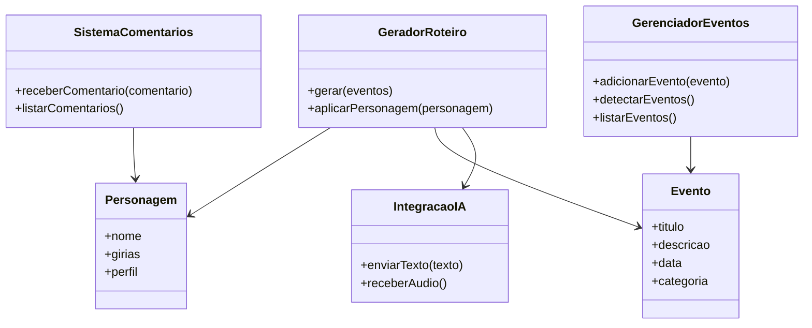

# 🗂️ Diagrama de Classes - BubuiA News

```mermaid
classDiagram
    class GeradorRoteiro {
        +gerar(eventos)
        +aplicarPersonagem(personagem)
    }
    class IntegracaoIA {
        +enviarTexto(texto)
        +receberAudio()
    }
    class GerenciadorEventos {
        +adicionarEvento(evento)
        +detectarEventos()
        +listarEventos()
    }
    class SistemaComentarios {
        +receberComentario(comentario)
        +listarComentarios()
    }
    class Personagem {
        +nome
        +girias
        +perfil
    }
    class Evento {
        +titulo
        +descricao
        +data
        +categoria
    }

    GeradorRoteiro --> Personagem
    GeradorRoteiro --> Evento
    GeradorRoteiro --> IntegracaoIA
    GerenciadorEventos --> Evento
    SistemaComentarios --> Personagem
```
